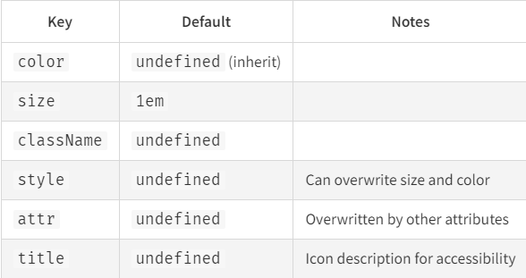

# Project Manager Front-end
# Backend repository: <a href="https://github.com/matheusmartinsviana/project-manager" target="_blank">Backend</a>

# Project Infos
Why I use modular CSS?  

- **Local Scope**: CSS modules allow you write a style for a specific component without class name conflicts because pf another component with the same class name.

- **Code Maintenance**: You don't have to go through large CSS files to find the styles you want to change. It's easier to maintain and update your code.

- **Better performance**: Styles are only applied where they are needed, you can end up with a smaller, more efficient CSS file.

## Font used
<a href="https://fonts.google.com/selection/embed" target="_blank">Onest by google fonts</a>

## Icons

<a href="https://react-icons.github.io/react-icons/" target="_blank">React Icons</a>

## Backend API used
Repository: <a href="https://github.com/matheusmartinsviana/project-manager" target="_blank">Click here</a>  
Documentation: <a href="https://matheusmartinsviana.github.io/project-manager-documentation/#api-_" target="_blank">Click here</a>

